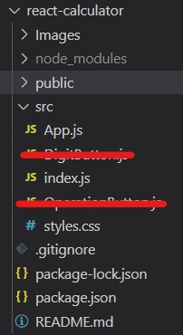
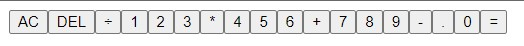
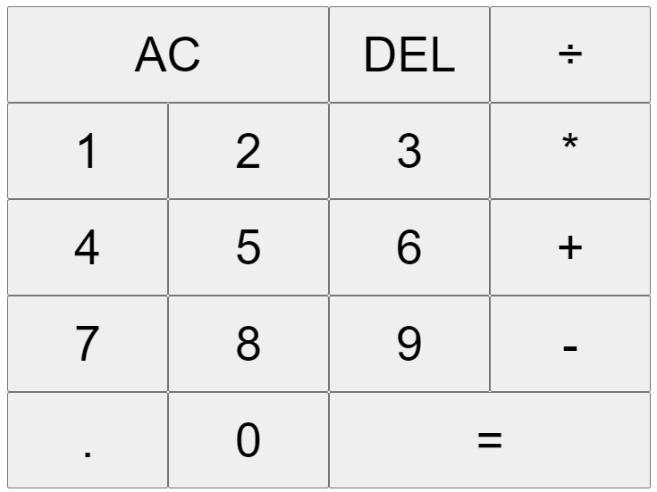
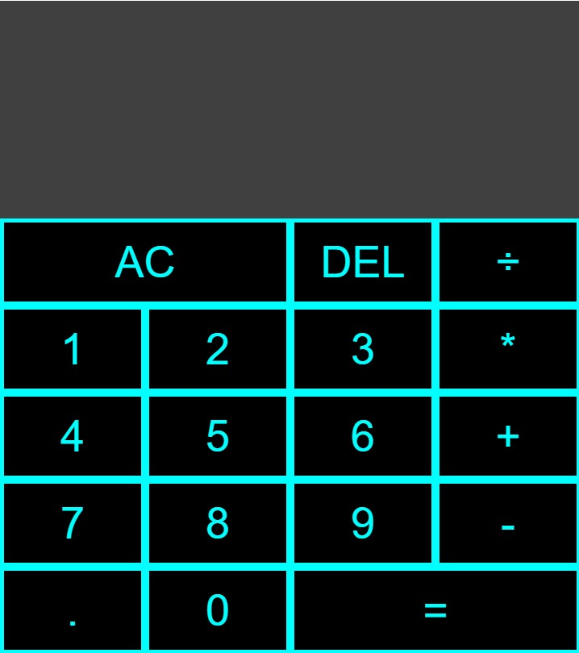
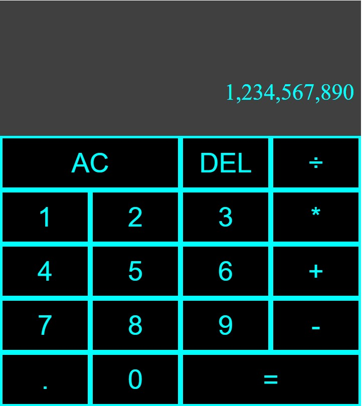
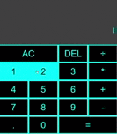

# React Calculator
---
<p align="center">

</p>

## This is a full functional calculator made using:
---
- HTML
- CSS
- JavaScript 
- ReactJs - A JavaScript library for building user interfaces  

## Build Method
---
1. after running the code to create react templete:
```
npx create-react-app app-name
cd app-name
npm start
```
2. I removed any unnecessary files, leaving just core files.
<p align="center">
    
</p>

3. I then made the buttons I want to use.

<p align="center">
    
</p>

4. I then used flexbox to arrange my calculator buttons, span to increase the **All Clear (AC)** and **Equals (=)** button size.

<p align="center">

</p>

5. Adding style to the calculator

<p align="center">

</p>

6. adding hover and focus functionality

<p align="center">

</p>

7. adding number functions

<p align="center">

</p>

8. Adding calculation functionality

<p align="center">

</p>