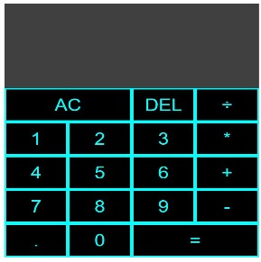

# React Calculator
---

This is a full functional calculator made using:

- JavaScript - programming language
- ReactJs - A JavaScript library for building user interfaces  

## I made this working project while learning the React frame work.
